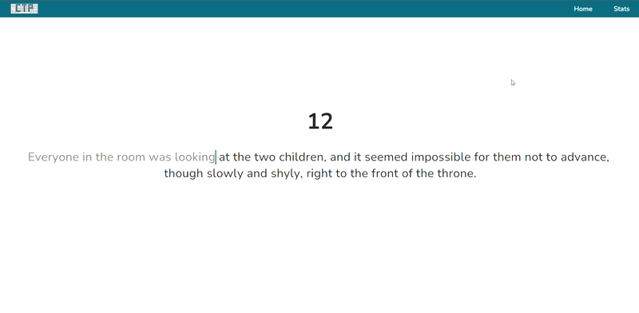

    <h1>Typing Practice</h1>
    
My typing speed was slow, and I wanted to improve my TypeScript and NextJS. This is the result!

     
    

## Live Demo

Check out a demo here:
<a href="https://www.customtypingpractice.com/">https://www.customtypingpractice.com/</a>

## Summary

Typing, Typing Practice, Typing Test and more all have 100K-1M searches per month with low competition. Most of the typing websites out there look like they were made in the 90s, so I figured it would be a fun project to improve my Typescript and NextJS while also providing a useful resource to people who were trying to improve their typing skills.

## Notes

To get the paragraphs I downloaded 10 open source novals, then split them by ".", "!", and "?". I then got a list of the 3000 most common english words, and filtered any sentence that didn't contain at least 10 of them. The goal was to make the sentences fun to type, while also providing practice for the most common english words.

In a testing environment I have also created a typing option that gives the user words based on how often they mistype certain letters.

For example:
const A = ['ardvark', 'bazaar', ...]
cosnt B = ['able', 'buzzer', ...]

The user will be given n shuffled words for each letter depending on their accuracy

## Road Map & Ideas

I'd like to find users who have the fastest improvement, then look for commonalities. (letter accuracy, list choice, frequency, accuracy per session, etc) I think this would allow me to understand what yeilds the best results.

Add a heat map for letters based on their accuracy. (Letters mistyped more often would be a darker shade.) I believe this would give the user more awareness when typing letters that are a common issue for them

Racing, but with a lobby for people to practice in while they're waiting

Ability to press a key, and add a word to a favorite list to be typed later

Add the ability to "freeze" or pause on a word, allowing the user to type word over and over
